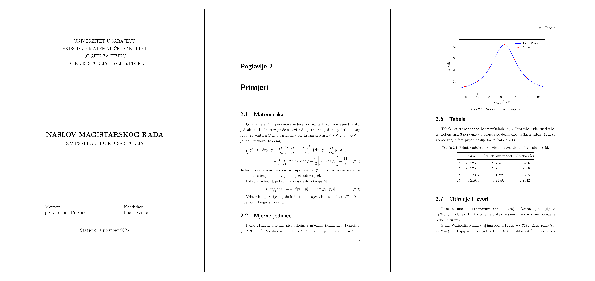
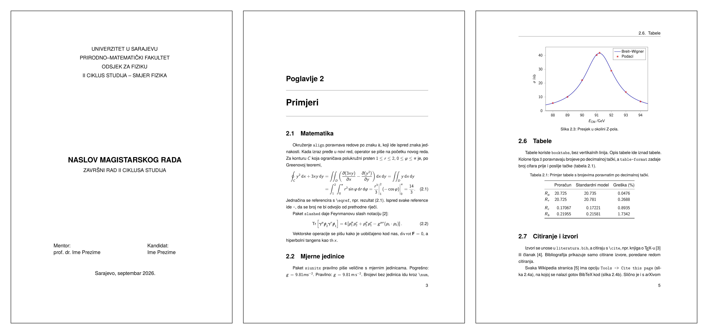
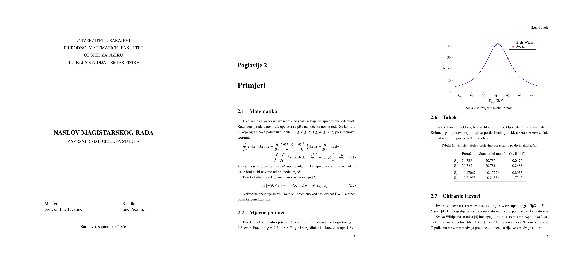
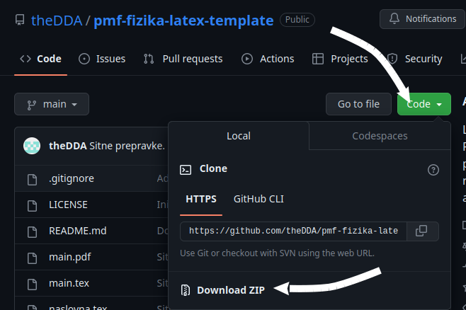

# pmf-fizika-magistarski-template

LaTeX template za završne radove II ciklusa studija na Odsjeku za fiziku PMF Sarajevo.

Nastao je iz [templatea za seminarske radove](https://github.com/theDDA/pmf-fizika-latex-template).

## Stilovi

Font teksta i matematike se bira jednim redom na vrhu `main.tex`:

```latex
\providecommand\stil{1}
```

Stil 1:



Stil 2:



Stil 3:



Sve ostalo (margine, naslovi, tabele, grafici) je isto u sva tri stila.

## Kompajliranje

`pdflatex` + `biber`. Overleaf i `latexmk` to rade automatski:

```sh
latexmk -pdf main.tex
```

## Struktura

| Fajl | Sadržaj |
|---|---|
| `main.tex` | Izbor stila, podaci za naslovnu stranicu, redoslijed poglavlja |
| `preamble.tex` | Paketi, izgled stranice i naslova |
| `stilovi/` | Po jedan fajl za svaki stil fonta |
| `naslovna.tex`, `naslovna_eng.tex` | Naslovne stranice na bosanskom i engleskom |
| `abstract.tex`, `zahvala.tex` | Sažetak, abstract i zahvala |
| `chapters/` | Poglavlja, svako u svom folderu sa svojim slikama i podacima |
| `slike/` | Zajedničke slike |
| `literatura.bib` | Izvori |
| `komande.tex`, `prelamanja.tex` | Vlastite komande i pravila za prelamanje riječi |
| `localSettings.yaml` | Postavke za `latexindent -l` (formatiranje koda) |

Poglavlje `chapters/primjeri` pokazuje jednačine, slike, Feynmanove dijagrame, grafike, tabele i citiranje.

Ukoliko ne koristite inače GitHub, da preuzmete čitav projekt kliknite gore desno na Code i Download ZIP.



Autor: Damir Agačević, 2025.

GNU GPLv3
